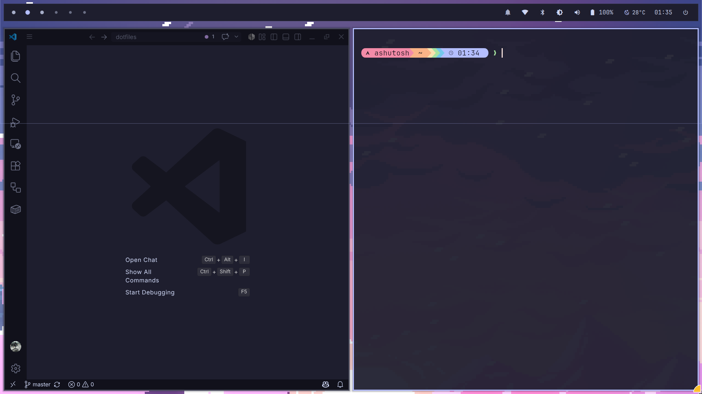

# Predator Arch Desktop

A complete, opinionated Arch Linux desktop built around Hyprland, Quickshell and
UWSM. It uses Catppuccin Mocha with a Lavender accent, a compact square-edged UI,
JetBrains Mono Nerd Font in the shell, and Inter in desktop applications.



> [!WARNING]
> This repository is primarily a personal backup and reference for one specific
> machine. A clean, 1:1 installation has not been fully tested, so I do not
> recommend applying it wholesale to another system. You are welcome to study,
> copy and adapt any parts that are useful for your own setup.

The repository is usable as a daily desktop without the custom login screen. The
greetd configuration and this machine's NVIDIA setup are optional and should only
be adopted after the user session works.

## What is included

- Hyprland configuration in Lua, with workspaces, restrained animations,
  scratchpad, resize mode, media keys, screenshots and session controls.
- A native Quickshell bar with audio, brightness, battery, Bluetooth, network,
  weather, notifications, tray, MPRIS media controls and expanding workspace
  indicators.
- Matching popups, notification toasts, OSDs, calendar and wallpaper picker.
- Hyprpaper, Hyprlock and Hypridle configuration.
- Kitty, Rofi, Zsh, Starship, GTK, Qt6 and fontconfig theming.
- Optional greetd + Quickshell graphical login flow.
- Safe scripts for wallpaper selection, screenshots, system deployment and state
  snapshots.

## Before installing

This is a real machine configuration, not a hardware-neutral distribution. Read
and change these values first:

| Setting | File | Current value |
| --- | --- | --- |
| Monitor scale | `home/.config/hypr/hyprland.lua` | `1.25` |
| Weather city and coordinates | `home/.config/quickshell/predator-shell/services/WeatherService.qml` | Lucknow, India |
| Wallpaper directory and helper | `home/.config/quickshell/predator-shell/services/WallpaperService.qml` | `/home/ashutosh/...` |
| Screenshot helper bindings | `home/.config/hypr/hyprland.lua` | `/home/ashutosh/...` |
| Session label | `home/.config/quickshell/predator-shell/popups/PowerMenuPopup.qml` | `ashutosh · predator` |
| User PATH | `home/.config/environment.d/10-path.conf` | `/home/ashutosh/.local/bin` |
| Qt color-scheme path | `home/.config/qt6ct/qt6ct.conf` | `/home/ashutosh/...` |
| Greeter account | `system/etc/xdg/quickshell/predator-greeter/shell.qml` | `ashutosh` |

Replace `/home/ashutosh` with your home directory and change the greeter account
before deploying the login screen. Review every match with:

```bash
rg -n '/home/ashutosh|ashutosh|Lucknow' home system
```

The tracked package snapshots describe the original laptop. Do **not** blindly
install its `nvidia-580xx-*` packages. Select graphics drivers appropriate for
your GPU and current Arch kernel.

## 1. Install Arch and the core packages

Start with a working Arch installation, a non-root user with `sudo`, networking,
and the correct graphics driver. Then install the repository's official-package
baseline:

```bash
sudo pacman -S --needed \
  base-devel git hyprland uwsm quickshell greetd \
  hypridle hyprlock hyprpaper hyprpolkitagent \
  xdg-desktop-portal-hyprland xdg-desktop-portal-gtk \
  pipewire pipewire-alsa pipewire-audio pipewire-pulse wireplumber \
  networkmanager bluez bluez-utils upower brightnessctl playerctl \
  kitty rofi rofi-calc rofi-emoji \
  grim slurp wl-clipboard libnotify xdg-utils xdg-user-dirs \
  qt6-wayland qt6ct kvantum dolphin \
  papirus-icon-theme inter-font ttf-jetbrains-mono-nerd noto-fonts-emoji \
  zsh starship zsh-autosuggestions zsh-syntax-highlighting \
  curl file rsync python
```

Some names can move between Arch repositories over time. If Pacman cannot find a
package, check the current Arch package database instead of substituting an
untrusted binary.

For the exact appearance, also install these optional theme packages from a
source you trust:

- Bibata Modern Classic cursor theme
- Darkly Qt style
- Catppuccin Mocha Lavender Kvantum theme
- Catppuccin Mocha Lavender GTK theme

The last known machine inventory is in `state/packages-official.txt` and
`state/packages-foreign.txt`; it is reference material, not an install manifest.

## 2. Clone the repository

The examples assume `~/dotfiles`, but the user configuration can live anywhere:

```bash
git clone <your-fork-or-clone-url> ~/dotfiles
cd ~/dotfiles
```

Make the machine-specific edits listed above before creating links.

## 3. Link the user configuration

The commands below refuse to overwrite existing paths. Back up any configuration
you already have, then run them from the repository root:

```bash
mkdir -p ~/.config ~/.config/quickshell ~/.config/autostart ~/.local/bin

ln -s "$PWD/home/.config/hypr" ~/.config/hypr
ln -s "$PWD/home/.config/quickshell/predator-shell" ~/.config/quickshell/predator-shell
ln -s "$PWD/home/.config/kitty" ~/.config/kitty
ln -s "$PWD/home/.config/rofi" ~/.config/rofi
ln -s "$PWD/home/.config/gtk-3.0" ~/.config/gtk-3.0
ln -s "$PWD/home/.config/gtk-4.0" ~/.config/gtk-4.0
ln -s "$PWD/home/.config/qt6ct" ~/.config/qt6ct
ln -s "$PWD/home/.config/fontconfig" ~/.config/fontconfig
ln -s "$PWD/home/.config/environment.d" ~/.config/environment.d
ln -s "$PWD/home/.config/kdeglobals" ~/.config/kdeglobals
ln -s "$PWD/home/.config/kvantum" ~/.config/kvantum
ln -s "$PWD/home/.config/starship.toml" ~/.config/starship.toml
ln -s "$PWD/home/.config/zsh" ~/.config/zsh
ln -s "$PWD/home/.config/autostart/predator-shell.desktop" ~/.config/autostart/predator-shell.desktop
ln -s "$PWD/home/.local/bin/set-wallpaper" ~/.local/bin/set-wallpaper
ln -s "$PWD/home/.local/bin/screenshot" ~/.local/bin/screenshot
```

If any `ln` command reports that a file exists, stop and move that exact path to
a backup first. Do not use `ln -sf` on directories.

Set Zsh's configuration directory and optionally make it your login shell:

```bash
ln -s "$PWD/home/.config/zsh/.zshenv" ~/.zshenv
chsh -s /bin/zsh
```

Install the pinned KDE color scheme and apply the GTK preferences:

```bash
scripts/setup-theme.sh
fc-cache -f
```

Log out and back in after changing `environment.d` or the login shell.

## 4. Initialize services and wallpaper

Enable the services needed by the desktop:

```bash
sudo systemctl enable --now NetworkManager bluetooth
systemctl --user enable --now pipewire.socket pipewire-pulse.socket wireplumber.service
systemctl --user enable --now hypridle.service hyprpaper.service hyprpolkitagent.service
```

Put at least one JPEG, PNG, WebP or JPEG XL image in
`~/Pictures/Wallpapers`, start a Hyprland session, and select it:

```bash
mkdir -p ~/Pictures/Wallpapers ~/Pictures/Screenshots
set-wallpaper ~/Pictures/Wallpapers/your-wallpaper.jpg
```

The selector stores an atomic symlink at
`~/.local/state/predator-shell/wallpaper`. Hyprpaper and Hyprlock share it, so the
desktop and lock screen use the same image.

## 5. Start the desktop

The simplest first run is from a TTY:

```bash
uwsm start -- hyprland.desktop
```

The XDG autostart entry launches one Quickshell instance inside the UWSM session.
If you need to test the shell independently:

```bash
qs -c predator-shell
```

Keep another TTY or SSH session available during the first run. Confirm the bar,
audio, networking, lock screen, wallpaper and logout before enabling a graphical
login manager.

## Optional: install the greetd login screen

The files under `system/` mirror root-owned paths; editing them does not change
the live system. The login path is:

```text
greetd
  → temporary minimal Hyprland compositor
  → Quickshell Predator greeter
  → greetd/PAM authentication
  → predator-session
  → UWSM
  → the real user Hyprland session
```

The greeter uses its own system-readable wallpaper because the restricted
`greeter` account cannot and should not traverse the user's private home
directory. Missing artwork falls back to Catppuccin Crust, and nonessential
visual failures do not change PAM or session behavior. Its interface uses
JetBrains Mono Nerd Font to match Predator Shell.

Before deployment, change both `accountName` and `displayName` in
`system/etc/xdg/quickshell/predator-greeter/shell.qml`. Keep TTY or SSH recovery
access available and inspect the exact deployment:

```bash
hyprland --verify-config --config system/etc/greetd/hyprland-greeter.lua
sh -n system/usr/local/libexec/predator-greeter
sh -n system/usr/local/libexec/predator-session
scripts/deploy-system.sh --dry-run
sudo scripts/deploy-system.sh --apply
```

The apply mode backs up every changed destination under
`/var/backups/predator-desktop.*` and prints a recovery manifest. It deliberately
does not restart greetd. From a recovery TTY, enable it only after the regular
UWSM session has been proven:

```bash
sudo systemctl enable greetd.service
sudo systemctl start greetd.service
```

Starting greetd can terminate or replace the current graphical login flow. Do it
only when unsaved work is closed and recovery access is available.

Greeter and session output is kept off the graphical VT but remains available in
the journal:

```bash
journalctl -b -u greetd.service
journalctl -b -t predator-greeter-compositor
journalctl -b -t predator-session
```

After deployment, test wrong and correct passwords, an empty submission,
keyboard-only login, logout and second login. Test the restart and shutdown
confirmations only when it is safe to actually restart or power off. A repository
dry-run cannot prove those end-to-end behaviors.

If the graphical greeter fails, switch to another TTY, stop greetd, and log in
normally:

```bash
sudo systemctl stop greetd.service
```

Restore the affected files using the manifest in the newest
`/var/backups/predator-desktop.*` directory, then start greetd again. The deploy
script never changes `/etc/pam.d/greetd`.

## Key bindings

| Keys | Action |
| --- | --- |
| `Super + Return` | Open Kitty |
| `Super + Space` | Application launcher |
| `Super + .` | Emoji picker |
| `Super + W` | Wallpaper picker |
| `Super + grave` | Kitty scratchpad |
| `Super + R` | Resize mode; use arrows or `h/j/k/l` |
| `Super + Escape` | Lock |
| `Super + Backspace` | Session power menu |
| `Print` / `Super + Shift + S` | Select an area to capture |
| `Shift + Print` | Capture the screen |
| `Ctrl + Print` | Capture the active window |
| `Super + Shift + Q` | End the UWSM session |

Workspaces use `Super + 1…5`; add `Shift` to move the active window. Mouse-wheel
over the workspace strip moves through workspaces. The indicator grows with
higher-numbered workspaces and always leaves a trailing empty destination.

## Maintenance and troubleshooting

Useful checks:

```bash
hyprctl configerrors
quickshell list
journalctl --user -b -u quickshell.service
systemctl --failed
systemctl --user --failed
```

Refresh the package and enabled-service snapshots after intentional system
changes. Run this as the desktop user, never with `sudo`:

```bash
scripts/snapshot.sh
```

The Quickshell source is organized by responsibility under
`home/.config/quickshell/predator-shell/`: `bar/`, `components/`, `popups/`,
`services/`, `notifications/`, `osd/` and `theme/`. Design rules and tokens are
documented in [DESIGN.md](DESIGN.md). Remaining machine-level verification is
tracked in [CHECKLIST.md](CHECKLIST.md).

For recovery, restore only the affected link or file from your backup. Avoid
whole-tree resets on a live symlinked configuration. For a failed system-file
deployment, follow the manifest in the newest `/var/backups/predator-desktop.*`
directory from a TTY or SSH session.

## Scope

This repository intentionally does not install a full desktop environment. It
does not use Waybar, SwayNC, SDDM, KDE Plasma or GNOME. Rofi is only the
application/emoji launcher; Quickshell owns the desktop shell UI.

## License

Licensed under the [MIT License](LICENSE). You are free to use this repository as
inspiration or adapt its components for your own desktop.
